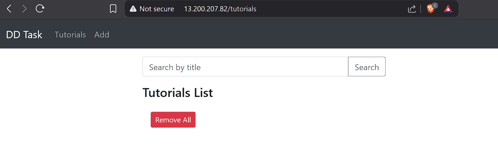
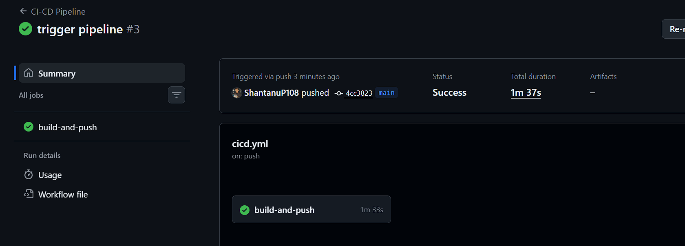
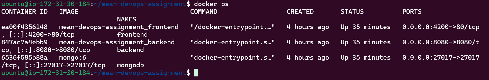
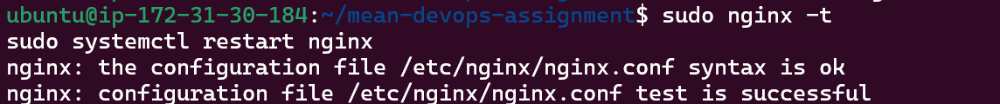
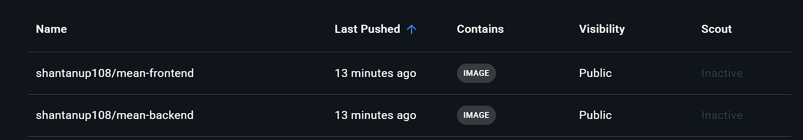
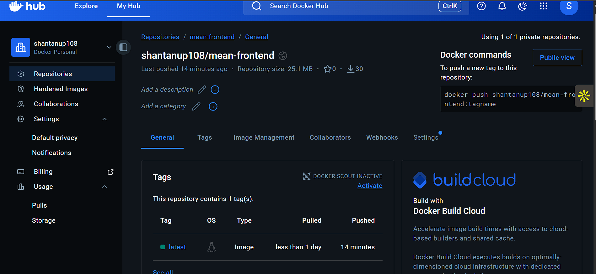
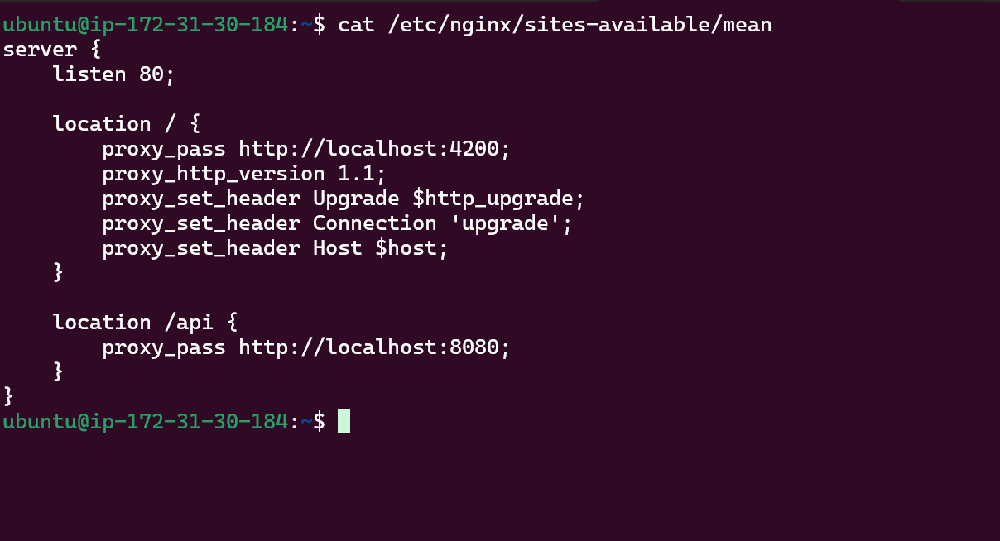
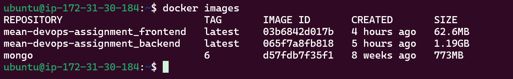
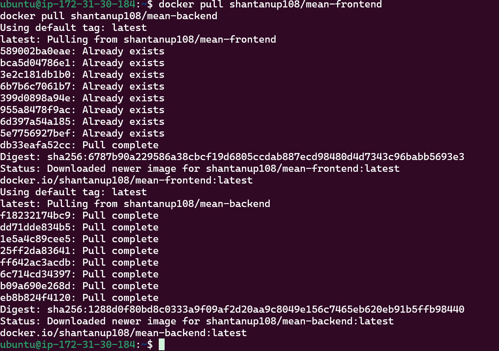

# 🚀 MEAN DevOps Assignment

A production-ready MEAN stack application deployed using Docker, CI/CD, AWS EC2, and Nginx reverse proxy.

---

## 🌐 Live Application

Frontend & Nginx Entry:
http://13.200.207.82

Frontend (direct container):
http://13.200.207.82:4200

Backend API:
http://13.200.207.82:8080

---

## 🧰 Tech Stack

- Angular (Frontend)
- Node.js + Express (Backend)
- MongoDB
- Docker & Docker Compose
- GitHub Actions (CI/CD)
- DockerHub (Image Registry)
- AWS EC2 (Deployment)
- Nginx (Reverse Proxy)

---

## 🐳 Run Locally with Docker

```bash
git clone https://github.com/ShantanuP108/mean-devops-assignment.git
cd mean-devops-assignment
docker-compose up -d --build
```

# Application will be available at:

Frontend → http://localhost:4200

Backend → http://localhost:8080

## ☁️ Deployment Steps

1. Launch EC2 (Ubuntu)

2. Install Docker & Docker Compose

3. Clone repository

4. Run: docker-compose up -d --build

5. Open ports 22, 4200, 8080 in security group

## 🔄 CI/CD Pipeline

GitHub Actions pipeline automatically:

✅ Builds frontend & backend Docker images
✅ Pushes images to DockerHub
✅ Enables production-ready container deployment

Workflow file:  .github/workflows/cicd.yml

## ScreenShots

## UI


## CI/CD Pipeline


## Containers


## nginx


## Dockerhub


## Dockerhub-frontend


## Dockerhub-backend


## Nginx-config


## Docker Images


## Docker Pull



##👨‍💻 Author

Shantanu

Navigate to `http://localhost:8081/`
test
3235393 (trigger pipeline)
